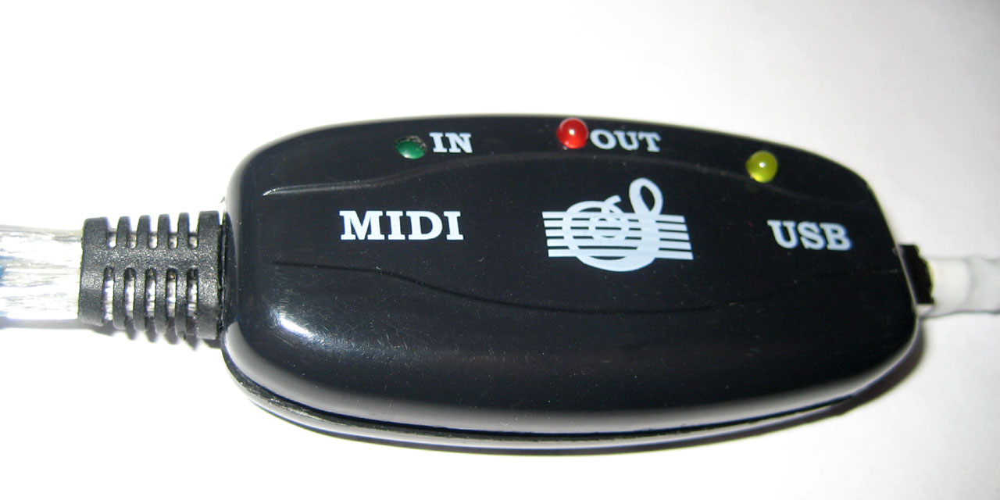
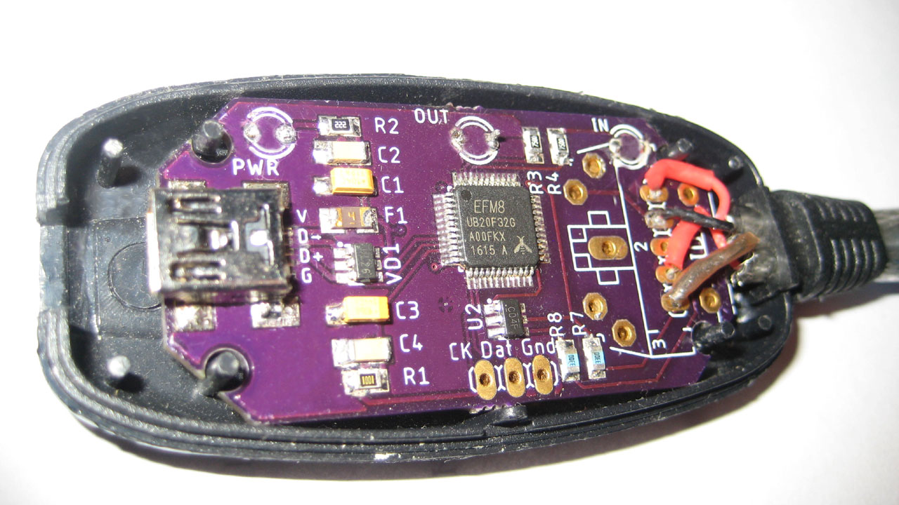
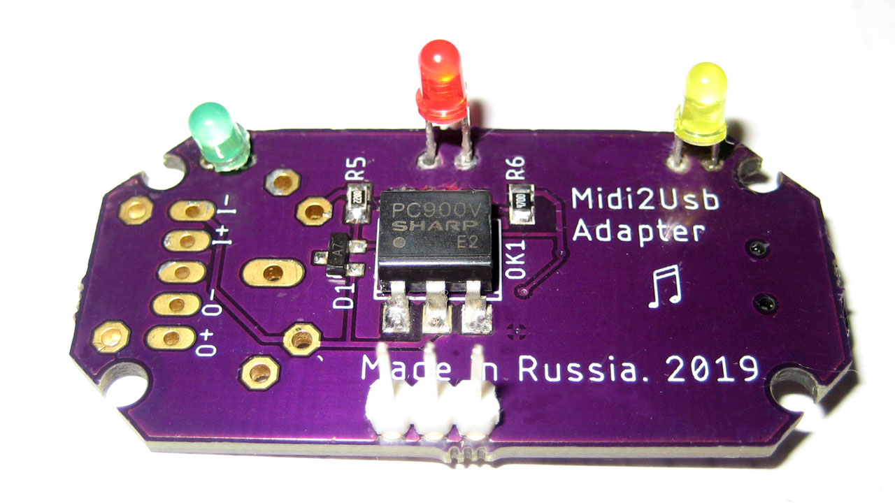

# MIDI2USB - Free and improved MIDI to USB Converter (MIT License).

This device is designed to connect various musical instruments to a PC via USB Fullspeed port. This is an improved version of the chinese adapter in the same case. There are: 1 IN port, 1 OUT port, 16 channels/instruments, Plug-and-Play feature, Build-in drivers. The adapter is compatible with Windows 7+ and was tested with MIDI-OX, MuseScore, Cubase, etc.
The device is based on Silicon Laboratories 8-bit 8051 MCU [EFM8UB20F32](https://www.silabs.com/mcu/8-bit/efm8-universal-bee/device.efm8ub20f32g-qfp32), (avg. price $2). This MCU has Fullspeed USB controller and adjustable internal oscillator (0.25%).

### Advantages of this MIDI2USB adapter:
* Open and clean source code with comments;
* Compliant to hardware and software [MIDI Specification 1.0](https://www.midi.org/specifications-old/item/the-midi-1-0-specification);
* All electronic components are available in your local shop;
* I use it myself.

The [`Hardware`](Hardware) folder contains Eagle CAD 9.0 schematics files, board file and component library. The .BRD file can be sent to your favourite PCB manufacturer. The board schematics can be found in the[`Hardware/Efm8Midi.png`](Hardware/Efm8Midi.png) file.

In the [`Firmware`](Firmware) folder you will find all C-source files for this project. Files from SiLabs SDK are located in the EFM8 subfolder. The project was developed with the [IAR Embedded Workbench IDE 8051](https://www.iar.com/iar-embedded-workbench/#!?architecture=8051). I beleive the source code is compatible with the [Keil uVision PK51](https://www.keil.com/c51/pk51kit.asp).

### Some pictures of this MIDI2USB converter :cool:

### TODO :pen:
- [ ] Switch to UART#1 with FIFO buffer;
- [ ] Test and improve SysEx handler;
- [ ] Move all components to one side;
- [ ] Find a sponsor :smile:

[GitHub readme tips&tricks](https://help.github.com/articles/basic-writing-and-formatting-syntax/)
